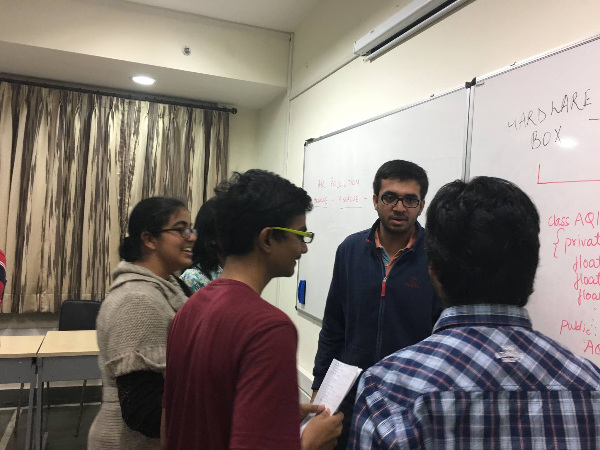
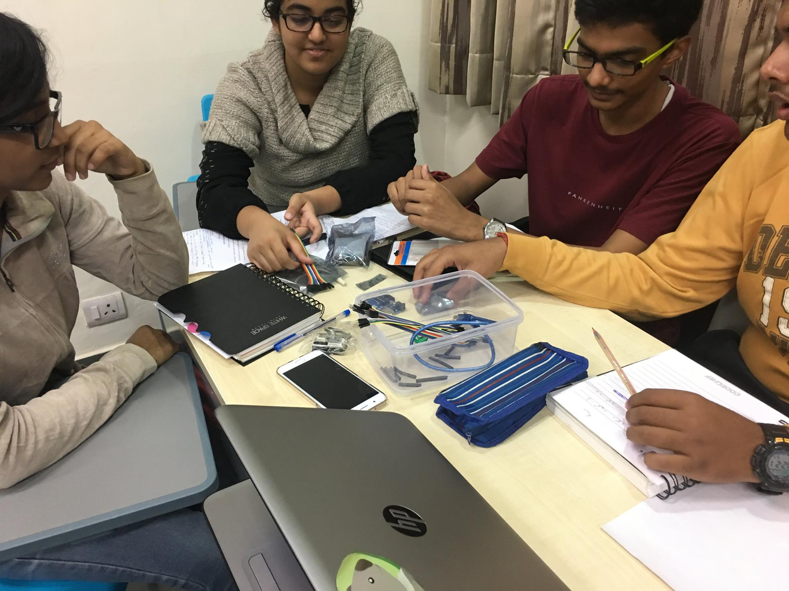
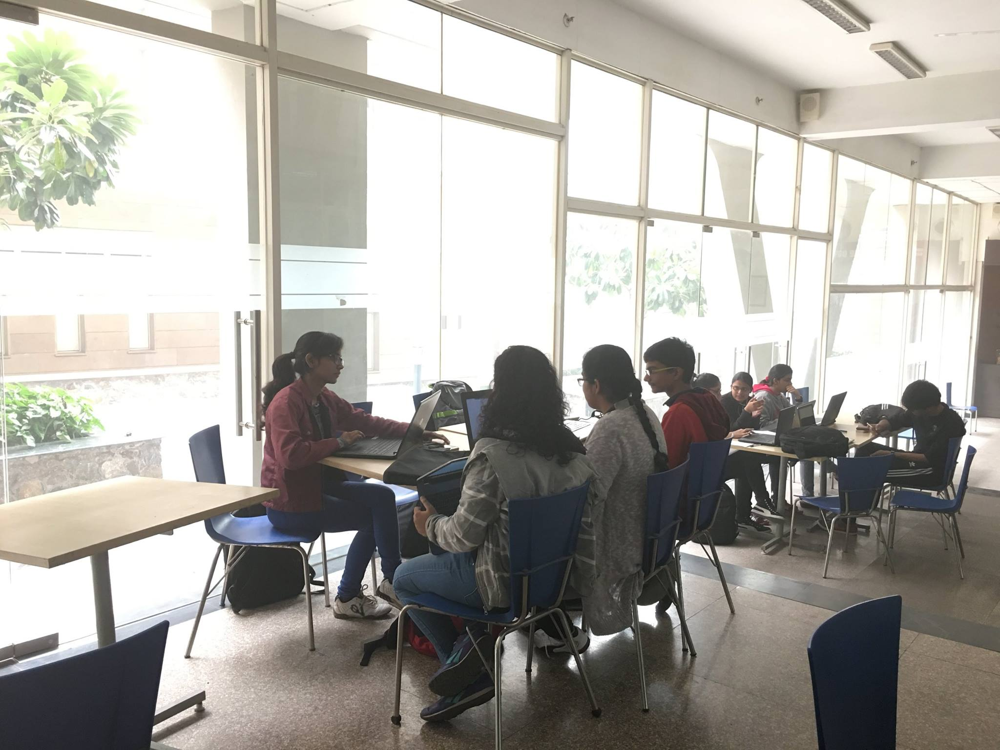
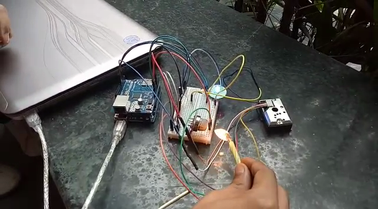

# Arduino Code for Makers-Box Air Pollution Hackathon.
This is the code that measures values from dust sensor (Sharp Dust Sensor) and Gas Sensor (MQ135)
It then displays Led colour in accordance with the sensor value to indicate amount of pollution, where the led blinks alternately, giving the output of both sensors visually on the same RGB led.

Inter-Teams Brainstorming Session, to understand deeply the solutions which need to be addressed in this domain 
  

Our team deciding on the Hardware Requirements(It was our first Hardware+Software Hackathon! Yay!) 
  

Our Team coding the final touches an hour before the presentations! 
  

Air Polution Monitor Hardware during the Demo 
  

Team Members :  
Baani Leen Kaur Jolly 
Viresh Gupta 
Peeyush Khushwaha 
Anushka Bhandari 
Akansha Gautam 
